# GR00T N1.7 on RoboLab

This guide shows the validated path for running the finetuned GR00T N1.7 DROID checkpoint on RoboLab tasks through the GR00T policy server.

## Why the DROID Checkpoint

RoboLab directly uses the DROID checkpoint published in the GR00T N1.7 Early Access (EA) release, without any RoboLab-specific finetuning. This is intentional: the purpose of the RoboLab benchmark is **zero-shot testing** of the released checkpoint. We evaluate the public EA DROID checkpoint as-is so the reported numbers reflect its out-of-the-box transfer to RoboLab simulation tasks, and so the comparison against the N1.6 DROID baseline stays apples-to-apples.

## Validation Snapshot

The current release baseline uses the public GR00T N1.7 DROID checkpoint and a minimal RoboLab client patch:

- GR00T model: `nvidia/GR00T-N1.7-DROID`
- Embodiment tag: `OXE_DROID_RELATIVE_EEF_RELATIVE_JOINT`
- RoboLab execution horizon: `--open-loop-horizon 8`
- Diffusion inference timesteps: model/release default, 4 denoising steps
- Episodes: 40 per task, 120 tasks

| Setup | Tasks | Episodes | Successes | Success rate |
| --- | ---: | ---: | ---: | ---: |
| GR00T N1.7 DROID + RoboLab ([branch](https://github.com/xiaotongc0/RoboLab/tree/n17-release-minimal)) | 120 | 4,800 | 412 | 8.58% |
| N1.6 reference ([branch](https://github.com/nadunRanawaka1/Isaac-GR00T-n16-droid)) | 120 | 1,200 | 87 | 7.25% |

`--open-loop-horizon 8` is part of the reproduced result. It controls how many rows from each predicted action chunk RoboLab executes before querying the GR00T server again. It is separate from the model checkpoint action horizon.

## Successful Tasks

The N1.7 full-suite wins are concentrated in visually clear pick/place and short-horizon manipulation tasks:

| Task | Successes |
| --- | ---: |
| `BananaOnPlateTask` | 40/40 |
| `BananasInBinThreeTotalTask` | 38/40 |
| `UnstackRubiksCubeTask` | 38/40 |
| `SauceBottlesCrateTask` | 33/40 |
| `RubiksCubeOrBananaTask` | 32/40 |
| `BananaInBowlTask` | 31/40 |
| `BananasInBinOneMoreTask` | 31/40 |
| `RubiksCubeTask` | 25/40 |
| `RubiksCubeThenBananaTask` | 19/40 |
| `BananasInCrateTask` | 18/40 |
| `FoodPacking1CansTask` | 16/40 |
| `RedDishesInBinTask` | 15/40 |
| `TakeMeasuringSpoonOutTask` | 12/40 |

Failures are more common on cluttered scenes, long-horizon packing, precise shelf placement, and sequential tasks that need recovery after a poor grasp.

## Video Showcases

The final full-suite run used `--video-mode none`, so the success-rate table above is the authoritative quantitative result but not the source of MP4s. The videos below are all unique task families with at least one confirmed successful trial in the recovered diagnostic video runs. Some high-success tasks from the final table are not shown because their video shards were not recoverable.

Click any preview image to open the corresponding MP4.

| Task | Demo |
| --- | --- |
| Rubik's Cube in Bowl | [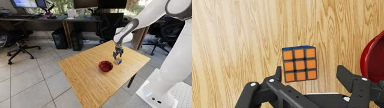](media/robolab/videos/robolab_rubiks_cube_success.mp4)<br>Fast single-object grasp and bowl placement. |
| Unstack Rubik's Cubes | [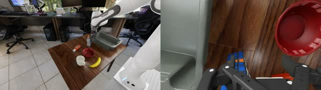](media/robolab/videos/robolab_unstack_rubiks_cube_success.mp4)<br>Short-horizon unstacking behavior. |
| Sauce Bottle to Crate | [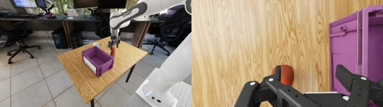](media/robolab/videos/robolab_sauce_bottle_crate_success.mp4)<br>Bottle grasp and placement into a constrained crate. |
| Rubik's Cube and Banana | [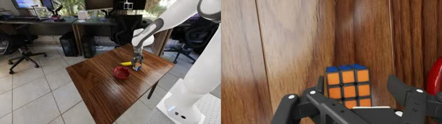](media/robolab/videos/robolab_rubiks_cube_and_banana_success.mp4)<br>Two-object bowl placement. |
| Rubik's Cube then Banana | [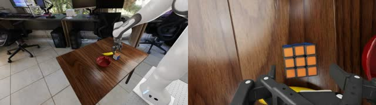](media/robolab/videos/robolab_rubiks_cube_then_banana_success.mp4)<br>Sequential cube-and-banana bowl placement. |
| Red Dishware to Bin | [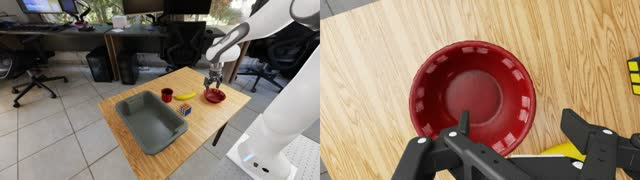](media/robolab/videos/robolab_red_dishes_bin_success.mp4)<br>Color-conditioned dishware sorting. |
| Measuring Spoon Out | [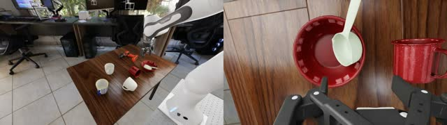](media/robolab/videos/robolab_take_measuring_spoon_out_success.mp4)<br>Extracts the measuring spoon from the bowl and places it on the table. |
| Butter on Raisin Box | [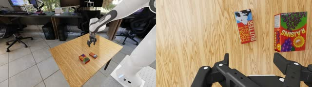](media/robolab/videos/robolab_butter_above_raisin_success.mp4)<br>Places one boxed object on top of another. |
| Mustard on Raisin Box | [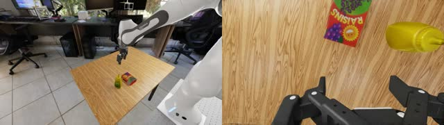](media/robolab/videos/robolab_mustard_above_raisin_success.mp4)<br>Longer placement sequence with a tall object. |
| Plastic Bottles to Pail | [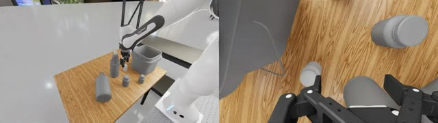](media/robolab/videos/robolab_plastic_bottles_square_pail_success.mp4)<br>Multi-object pail placement. |
| Bowl to Shelf | [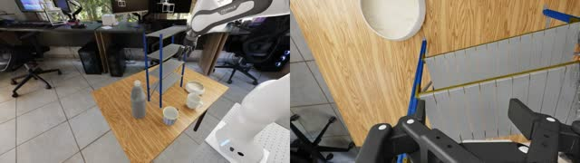](media/robolab/videos/robolab_put_bowl_on_shelf_success.mp4)<br>Places a bowl onto the shelf. |

## N1.6 Reference

The N1.6 comparison used the RoboLab author's N1.6 DROID branch:

- Code reference: [`nadunRanawaka1/Isaac-GR00T-n16-droid`](https://github.com/nadunRanawaka1/Isaac-GR00T-n16-droid)
- Model: [`nvidia/GR00T-N1.6-DROID`](https://huggingface.co/nvidia/GR00T-N1.6-DROID)
- Embodiment: `OXE_DROID` / `oxe_droid:16`
- Dashboard reference: `87/1200 = 7.25%`
- Local reproduction: `94/1200 = 7.83%`

The N1.6 runs used 10 trials per task. The N1.7 release run above used 40 trials per task, so compare success rates rather than raw success counts.

## Reproduction Steps

### Parameters

| Setting | Value |
| --- | --- |
| Model | `nvidia/GR00T-N1.7-DROID` |
| Embodiment tag | `OXE_DROID_RELATIVE_EEF_RELATIVE_JOINT` |
| GR00T server wrapper | `--use-sim-policy-wrapper` |
| Inference timesteps | Release default, 4, tried 8, giving similar result |
| RoboLab execution horizon | `--open-loop-horizon 8` |
| Observation cameras | left exterior + left wrist |
| Image transport | HWC `uint8`, no letterbox or black padding, `180x320` |

### Install

Install Isaac-GR00T:

```bash
git clone --recurse-submodules https://github.com/NVIDIA/Isaac-GR00T.git
cd Isaac-GR00T
curl -LsSf https://astral.sh/uv/install.sh | sh
uv sync --python 3.10
```

Install RoboLab from the patched branch:

```bash
git clone --branch n17-release-minimal https://github.com/xiaotongc0/RoboLab.git
cd RoboLab
python -m pip install -e .
```

The GR00T RoboLab client needs:

```bash
python -m pip install msgpack-numpy pyzmq opencv-python
```

RoboLab should provide the GR00T runner:

```bash
python policies/gr00t/run.py --help
```

### Start GR00T

Start one GR00T server:

```bash
cd Isaac-GR00T

CUDA_VISIBLE_DEVICES=0 uv run python gr00t/eval/run_gr00t_server.py \
    --model-path nvidia/GR00T-N1.7-DROID \
    --embodiment-tag OXE_DROID_RELATIVE_EEF_RELATIVE_JOINT \
    --device cuda \
    --host 127.0.0.1 \
    --port 5555 \
    --use-sim-policy-wrapper
```

The server is ready when it prints:

```text
Server is ready and listening on tcp://127.0.0.1:5555
```

### Run RoboLab

Run a smoke test first:

```bash
cd RoboLab

CUDA_VISIBLE_DEVICES=0 python policies/gr00t/run.py \
    --headless \
    --remote-host 127.0.0.1 \
    --remote-port 5555 \
    --task BananaOnPlateTask \
    --num-envs 10 \
    --num-runs 1 \
    --open-loop-horizon 8 \
    --instruction-type default \
    --video-mode none
```

For a more stable estimate, use the largest `--num-envs` that fits GPU memory:

```bash
CUDA_VISIBLE_DEVICES=0 python policies/gr00t/run.py \
    --headless \
    --remote-host 127.0.0.1 \
    --remote-port 5555 \
    --task BananaOnPlateTask \
    --num-envs 40 \
    --num-runs 1 \
    --open-loop-horizon 8 \
    --instruction-type default \
    --video-mode none
```

Useful setup-smoke tasks:

- `BananaOnPlateTask`
- `BananaInBowlTask`
- `BananasInBinThreeTotalTask`
- `UnstackRubiksCubeTask`
- `SauceBottlesCrateTask`

### Example 4-GPU Layout

For faster evaluation on a 4-GPU node, run two GR00T servers and two RoboLab workers:

| GPU | Process |
| --- | --- |
| 0 | GR00T server A |
| 1 | GR00T server B |
| 2 | RoboLab eval worker A |
| 3 | RoboLab eval worker B |

Each RoboLab worker should point to a different server port and receive a disjoint task shard. Keep the same model, embodiment tag, horizon, camera, image, and video settings across shards.

The GR00T server and Robolab client can also share a GPU, with smaller `--num-envs` parallel environments.

## RoboLab Observation Contract

The N1.7 DROID client sends this request shape to the policy server:

| Group | Key | Shape | Dtype |
| --- | --- | --- | --- |
| Video | `video.exterior_image_1_left` | `[B, T, H, W, 3]` | `uint8` |
| Video | `video.wrist_image_left` | `[B, T, H, W, 3]` | `uint8` |
| State | `state.eef_9d` | `[B, T, 9]` | `float32` |
| State | `state.joint_position` | `[B, T, 7]` | `float32` |
| State | `state.gripper_position` | `[B, T, 1]` | `float32` |
| Language | `annotation.language.language_instruction` | `[B]` | string |

Use `T=1` for the current baseline. Map RoboLab `over_shoulder_left_camera` to GR00T `exterior_image_1_left`, and RoboLab `wrist_cam` to GR00T `wrist_image_left`.

The GR00T response contains chunked `action.joint_position` and `action.gripper_position`. Concatenate those actions and execute only the first 8 rows before querying the server again.

## Image Handling

Do not letterbox. Do not add black bars.

The validated RoboLab client sends 16:9 HWC `uint8` images at `180x320`. This is only the transport size; the N1.7 processor still applies its model-side image transform after receiving the image.

Avoid square client images unless deliberately running an ablation. Square stretching changes scene geometry, and square padding reintroduces letterbox bars.

## Ablation Notes

Useful checks from the validation sweep:

| Factor | Outcome |
| --- | --- |
| 8 denoising steps instead of 4 | No meaningful full-suite improvement; roughly doubles DiT inference work. |
| Additional camera inputs | No stable improvement over left exterior + left wrist in the tested configs. |
| History frames | No stable improvement in the tested configs. |

## Outputs And Dashboard

For throughput sweeps, use `--video-mode none`. RoboLab still writes run summaries, task logs, HDF5 trajectories, timing, and per-task result rows.

For inspectable diagnostic runs, use:

```bash
--video-mode all --enable-subtask
```

`--video-mode all` writes both policy/sensor and viewport mp4s beside the task outputs. `--enable-subtask` populates score and failure-reason fields when task subtask tracking is available.

The RoboLab dashboard reads an output directory containing run folders:

```bash
robolab-dashboard --output-dir RoboLab/output --port 8080
```

The dashboard uses `episode_results.jsonl` as the canonical per-episode summary and discovers mp4s, per-env logs, and HDF5 files from each task directory.

## Troubleshooting

If the server returns `SVD did not converge`, save the task name and server log. This is a numerical robustness issue in the action decode path, not a RoboLab installation problem.

If RoboLab crashes before launching IsaacSim, check for duplicate argparse flags between RoboLab and IsaacLab's `AppLauncher`.
